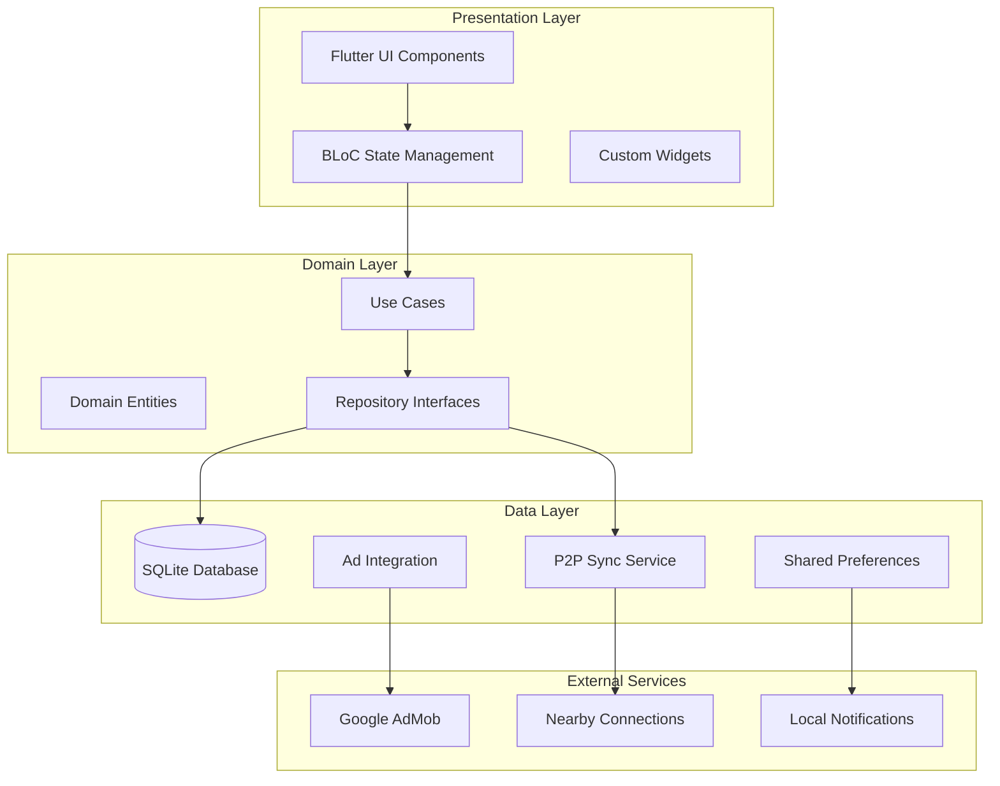

# ZiberLive Roommate Collaboration App - Design Document

## Overview

ZiberLive is designed as an offline-first roommate collaboration platform that enables seamless apartment management through P2P synchronization, dynamic bill splitting, community cooking coordination, and investment group management. The architecture prioritizes local data storage with SQLite, P2P networking via nearby_connections, and strategic ad placement for monetization while maintaining a free core experience.

The design emphasizes psychological engagement through gamification (Community Tree, Co-Living Credits), nature-inspired UI themes, and collaborative features that build community while working toward financial independence through shared investments.

## Architecture

### High-Level Architecture



### Core Architecture Principles

1. **Offline-First Design**: All core functionality works without internet connectivity
2. **P2P Synchronization**: Data syncs directly between devices on the same Wi-Fi network
3. **Local Data Persistence**: SQLite as primary data store with encrypted sensitive data
4. **Modular Component Design**: Feature-based architecture for maintainability
5. **Reactive State Management**: BLoC pattern for predictable state changes
6. **Ad-Integrated Monetization**: Strategic ad placement during sync operations

## Components and Interfaces

### Core Data Models

#### User Management Models
```dart
class User {
  final String id;
  final String name;
  final String email;
  final UserRole role;
  final String apartmentId;
  final String? roomId;
  final String? bedId;
  final List<Subscription> subscriptions;
  final int coLivingCredits;
  final DateTime createdAt;
  final DateTime lastSyncAt;
}

class Subscription {
  final String id;
  final SubscriptionType type; // community_cooking, drinking_water, rent, utilities
  final String customName;
  final bool isActive;
  final DateTime startDate;
  final DateTime? endDate;
}

enum UserRole { user, roommateAdmin }
enum SubscriptionType { communityCooking, drinkingWater, rent, utilities }
```

#### Bill Management Models
```dart
class Bill {
  final String id;
  final String name;
  final double amount;
  final BillType type;
  final String apartmentId;
  final String createdBy;
  final List<String> splitUserIds;
  final Map<String, PaymentStatus> paymentStatuses;
  final DateTime dueDate;
  final DateTime createdAt;
  final bool isRecurring;
  final RecurrencePattern? recurrencePattern;
}

class PaymentStatus {
  final String userId;
  final double amount;
  final bool isPaid;
  final DateTime? paidAt;
  final PaymentMethod? paymentMethod;
}

enum BillType { rent, electricity, internet, water, communityCooking, custom }
```

#### Task and Schedule Models
```dart
class Task {
  final String id;
  final String name;
  final String description;
  final String apartmentId;
  final String assignedTo;
  final String createdBy;
  final DateTime dueDate;
  final TaskStatus status;
  final int creditsReward;
  final TaskType type;
  final DateTime createdAt;
}

class Schedule {
  final String id;
  final String name;
  final ScheduleType type; // cleaning, cooking, community_cooking
  final String apartmentId;
  final List<ScheduleSlot> slots;
  final RotationPattern rotationPattern;
  final DateTime startDate;
  final DateTime? endDate;
}

class ScheduleSlot {
  final String id;
  final DateTime startTime;
  final DateTime endTime;
  final String assignedUserId;
  final String? description;
  final bool isCompleted;
}
```

#### Investment and Gamification Models
```dart
class InvestmentGroup {
  final String id;
  final String name;
  final String apartmentId;
  final List<String> participantIds;
  final Map<String, double> contributions;
  final double totalContributions;
  final double currentValue;
  final double monthlyReturns;
  final List<Investment> investments;
  final DateTime createdAt;
}

class Investment {
  final String id;
  final String name;
  final String description;
  final double amount;
  final InvestmentType type;
  final double expectedReturn;
  final InvestmentStatus status;
  final DateTime investmentDate;
}

class CommunityTree {
  final String apartmentId;
  final int level;
  final int totalContributions;
  final Map<String, int> userContributions;
  final List<Achievement> unlockedAchievements;
  final TreeSeason currentSeason;
  final DateTime lastUpdated;
}
```

### Service Layer Architecture

#### P2P Synchronization Service
```dart
abstract class P2PSyncService {
  Future<void> initializeP2PNetwork();
  Future<List<Device>> discoverNearbyDevices();
  Future<void> connectToDevice(String deviceId);
  Future<void> syncData(SyncPayload payload);
  Stream<SyncStatus> getSyncStatusStream();
  Future<void> handleConflictResolution(ConflictData conflict);
}

class SyncPayload {
  final String dataType;
  final String operation; // create, update, delete
  final Map<String, dynamic> data;
  final DateTime timestamp;
  final String deviceId;
  final String checksum;
}
```

#### Local Database Service
```dart
abstract class LocalDatabaseService {
  Future<void> initializeDatabase();
  Future<T> insert<T>(String table, T entity);
  Future<T?> findById<T>(String table, String id);
  Future<List<T>> findAll<T>(String table);
  Future<void> update<T>(String table, T entity);
  Future<void> delete(String table, String id);
  Future<void> executeTransaction(List<DatabaseOperation> operations);
}

class DatabaseOperation {
  final String type; // insert, update, delete
  final String table;
  final Map<String, dynamic> data;
  final String? whereClause;
}
```

#### Gamification Service
```dart
abstract class GamificationService {
  Future<void> awardCredits(String userId, int credits, CreditReason reason);
  Future<void> updateCommunityTree(String apartmentId, TreeAction action);
  Future<List<Achievement>> checkAchievements(String userId);
  Future<void> processRedemption(String userId, RedemptionType type, int cost);
  Stream<CommunityTreeState> getCommunityTreeStream(String apartmentId);
}

enum CreditReason { billPayment, taskCompletion, voting, communityParticipation }
enum RedemptionType { adRemoval, cloudStorage, premiumFeatures }
```

### UI Component Architecture

#### Core UI Components
```dart
// Reusable card component with nature theme
class ZiberCard extends StatelessWidget {
  final Widget child;
  final Color? backgroundColor;
  final EdgeInsets? padding;
  final VoidCallback? onTap;
  
  @override
  Widget build(BuildContext context) {
    return Card(
      elevation: 2,
      shape: RoundedRectangleBorder(borderRadius: BorderRadius.circular(12)),
      color: backgroundColor ?? ZiberColors.cardBackground,
      child: InkWell(
        onTap: onTap,
        borderRadius: BorderRadius.circular(12),
        child: Padding(
          padding: padding ?? EdgeInsets.all(16),
          child: child,
        ),
      ),
    );
  }
}

// Animated Community Tree widget
class CommunityTreeWidget extends StatefulWidget {
  final CommunityTreeState treeState;
  final VoidCallback? onTap;
  
  @override
  _CommunityTreeWidgetState createState() => _CommunityTreeWidgetState();
}

// Bill split visualization component
class BillSplitChart extends StatelessWidget {
  final List<BillSplit> splits;
  final bool showPaymentStatus;
  
  @override
  Widget build(BuildContext context) {
    return PieChart(
      PieChartData(
        sections: splits.map((split) => PieChartSectionData(
          value: split.amount,
          title: split.userName,
          color: split.isPaid ? ZiberColors.paidGreen : ZiberColors.unpaidRed,
        )).toList(),
      ),
    );
  }
}
```

## Data Models

### Database Schema Design

#### Core Tables
```sql
-- Users table with subscription tracking
CREATE TABLE users (
    id TEXT PRIMARY KEY,
    name TEXT NOT NULL,
    email TEXT UNIQUE NOT NULL,
    role TEXT NOT NULL CHECK (role IN ('user', 'roommate_admin')),
    apartment_id TEXT NOT NULL,
    room_id TEXT,
    bed_id TEXT,
    subscriptions_json TEXT NOT NULL, -- JSON array of subscriptions
    co_living_credits INTEGER DEFAULT 0,
    created_at DATETIME DEFAULT CURRENT_TIMESTAMP,
    last_sync_at DATETIME DEFAULT CURRENT_TIMESTAMP,
    FOREIGN KEY (apartment_id) REFERENCES apartments(id)
);

-- Bills table with dynamic splitting
CREATE TABLE bills (
    id TEXT PRIMARY KEY,
    name TEXT NOT NULL,
    amount REAL NOT NULL,
    type TEXT NOT NULL,
    apartment_id TEXT NOT NULL,
    created_by TEXT NOT NULL,
    split_user_ids_json TEXT NOT NULL, -- JSON array of user IDs
    payment_statuses_json TEXT NOT NULL, -- JSON object of payment statuses
    due_date DATETIME NOT NULL,
    created_at DATETIME DEFAULT CURRENT_TIMESTAMP,
    is_recurring BOOLEAN DEFAULT FALSE,
    recurrence_pattern_json TEXT,
    FOREIGN KEY (apartment_id) REFERENCES apartments(id),
    FOREIGN KEY (created_by) REFERENCES users(id)
);

-- Tasks and schedules
CREATE TABLE tasks (
    id TEXT PRIMARY KEY,
    name TEXT NOT NULL,
    description TEXT,
    apartment_id TEXT NOT NULL,
    assigned_to TEXT NOT NULL,
    created_by TEXT NOT NULL,
    due_date DATETIME NOT NULL,
    status TEXT DEFAULT 'pending',
    credits_reward INTEGER DEFAULT 5,
    type TEXT NOT NULL,
    created_at DATETIME DEFAULT CURRENT_TIMESTAMP,
    FOREIGN KEY (apartment_id) REFERENCES apartments(id),
    FOREIGN KEY (assigned_to) REFERENCES users(id)
);

-- Investment groups and tracking
CREATE TABLE investment_groups (
    id TEXT PRIMARY KEY,
    name TEXT NOT NULL,
    apartment_id TEXT NOT NULL,
    participant_ids_json TEXT NOT NULL,
    contributions_json TEXT NOT NULL, -- JSON object mapping user_id to contribution
    total_contributions REAL DEFAULT 0,
    current_value REAL DEFAULT 0,
    monthly_returns REAL DEFAULT 0,
    created_at DATETIME DEFAULT CURRENT_TIMESTAMP,
    FOREIGN KEY (apartment_id) REFERENCES apartments(id)
);

-- Voting and polls
CREATE TABLE votes (
    id TEXT PRIMARY KEY,
    question TEXT NOT NULL,
    options_json TEXT NOT NULL, -- JSON array of options
    votes_json TEXT NOT NULL, -- JSON object of votes
    is_anonymous BOOLEAN DEFAULT FALSE,
    deadline DATETIME NOT NULL,
    apartment_id TEXT NOT NULL,
    created_by TEXT NOT NULL,
    created_at DATETIME DEFAULT CURRENT_TIMESTAMP,
    FOREIGN KEY (apartment_id) REFERENCES apartments(id)
);
```

#### Sync and Conflict Resolution Tables
```sql
-- Sync tracking for P2P operations
CREATE TABLE sync_log (
    id TEXT PRIMARY KEY,
    table_name TEXT NOT NULL,
    record_id TEXT NOT NULL,
    operation TEXT NOT NULL CHECK (operation IN ('create', 'update', 'delete')),
    timestamp DATETIME DEFAULT CURRENT_TIMESTAMP,
    device_id TEXT NOT NULL,
    synced BOOLEAN DEFAULT FALSE,
    conflict_resolved BOOLEAN DEFAULT TRUE
);

-- Device management for P2P network
CREATE TABLE devices (
    id TEXT PRIMARY KEY,
    device_name TEXT NOT NULL,
    last_seen DATETIME DEFAULT CURRENT_TIMESTAMP,
    is_trusted BOOLEAN DEFAULT FALSE,
    apartment_id TEXT NOT NULL,
    sync_capabilities_json TEXT NOT NULL
);
```

### Data Relationships and Constraints

#### Entity Relationships
- **Users** belong to **Apartments** and can have **Rooms/Beds**
- **Bills** are created by **Users** and split among subscribed **Users**
- **Tasks** are assigned to **Users** within **Apartments**
- **Investment Groups** contain multiple **Users** from the same **Apartment**
- **Votes** are created by **Users** and participated in by **Apartment** members

#### Business Rules and Constraints
1. **Bill Splitting Logic**: Only users with matching subscriptions are included in bill splits
2. **Credit System**: Credits are awarded for positive actions and can be redeemed for premium features
3. **Sync Conflict Resolution**: Last-writer-wins based on timestamp, with manual resolution for complex conflicts
4. **Role Permissions**: Roommate-Admins can manage users and bills, Users can participate and view

## Error Handling

### Error Categories and Strategies

#### Network and Sync Errors
```dart
class SyncError extends Exception {
  final SyncErrorType type;
  final String message;
  final DateTime timestamp;
  final String? deviceId;
  
  SyncError(this.type, this.message, {this.deviceId}) 
    : timestamp = DateTime.now();
}

enum SyncErrorType {
  connectionFailed,
  deviceNotFound,
  dataCorruption,
  conflictResolution,
  authenticationFailed
}

// Error handling strategy
class ErrorHandler {
  static void handleSyncError(SyncError error) {
    switch (error.type) {
      case SyncErrorType.connectionFailed:
        // Queue for retry, show offline indicator
        _queueForRetry(error);
        break;
      case SyncErrorType.dataCorruption:
        // Attempt data recovery, request fresh sync
        _attemptDataRecovery(error);
        break;
      case SyncErrorType.conflictResolution:
        // Show conflict resolution UI
        _showConflictResolutionDialog(error);
        break;
    }
  }
}
```

#### Data Validation Errors
```dart
class ValidationError extends Exception {
  final String field;
  final String message;
  final ValidationErrorType type;
  
  ValidationError(this.field, this.message, this.type);
}

enum ValidationErrorType {
  required,
  format,
  range,
  businessRule
}

// Validation service
class ValidationService {
  static ValidationResult validateBill(Bill bill) {
    final errors = <ValidationError>[];
    
    if (bill.amount <= 0) {
      errors.add(ValidationError('amount', 'Amount must be greater than 0', ValidationErrorType.range));
    }
    
    if (bill.splitUserIds.isEmpty) {
      errors.add(ValidationError('splitUserIds', 'At least one user must be selected', ValidationErrorType.businessRule));
    }
    
    return ValidationResult(errors);
  }
}
```

#### User Experience Error Handling
- **Graceful Degradation**: Core features work offline, sync when available
- **User-Friendly Messages**: Clear, actionable error messages in user's language
- **Retry Mechanisms**: Automatic retry for transient errors, manual retry for persistent issues
- **Error Recovery**: Data recovery options and backup restoration capabilities

## Testing Strategy

### Unit Testing Approach
```dart
// Example unit test for bill splitting logic
class BillSplittingServiceTest {
  late BillSplittingService service;
  late MockUserRepository mockUserRepo;
  
  @setUp
  void setUp() {
    mockUserRepo = MockUserRepository();
    service = BillSplittingService(mockUserRepo);
  }
  
  @test
  void shouldSplitBillEquallyAmongSubscribedUsers() {
    // Given
    final bill = Bill(
      id: '1',
      name: 'Electricity',
      amount: 1000.0,
      type: BillType.electricity,
      apartmentId: 'apt1',
      createdBy: 'user1',
      splitUserIds: ['user1', 'user2', 'user3'],
    );
    
    // When
    final splits = service.calculateSplits(bill);
    
    // Then
    expect(splits.length, equals(3));
    expect(splits.every((split) => split.amount == 333.33), isTrue);
  }
}
```

### Integration Testing Strategy
- **P2P Sync Testing**: Multi-device simulation for sync reliability
- **Database Migration Testing**: Schema changes and data integrity
- **Ad Integration Testing**: Ad display and revenue tracking
- **Offline Functionality Testing**: Complete offline operation validation

### User Acceptance Testing
- **Role-Based Testing**: Test all features for each user role
- **Workflow Testing**: End-to-end user journeys for common scenarios
- **Performance Testing**: App performance with 50+ users and large datasets
- **Accessibility Testing**: Screen reader support and accessibility compliance

### Testing Tools and Frameworks
- **Unit Tests**: Flutter test framework with mockito for mocking
- **Integration Tests**: Flutter integration test with device simulation
- **Widget Tests**: Flutter widget testing for UI components
- **Performance Tests**: Flutter performance profiling and memory analysis

## Security Considerations

### Data Encryption and Privacy
```dart
class EncryptionService {
  static const String _encryptionKey = 'user-generated-key';
  
  static String encryptSensitiveData(String data) {
    final key = Key.fromSecureRandom(32);
    final iv = IV.fromSecureRandom(16);
    final encrypter = Encrypter(AES(key));
    return encrypter.encrypt(data, iv: iv).base64;
  }
  
  static String decryptSensitiveData(String encryptedData) {
    // Decryption logic with proper key management
  }
}
```

### P2P Security Measures
- **Device Authentication**: Secure handshake protocol for device verification
- **Data Integrity**: Checksums and validation for all sync operations
- **Access Control**: Role-based permissions for all data operations
- **Audit Trails**: Complete logging of all data changes and sync operations

### Privacy Protection
- **Data Minimization**: Only collect necessary data for app functionality
- **User Consent**: Clear consent for data collection and processing
- **Data Retention**: Automatic cleanup of old data and logs
- **Export/Delete**: User rights to export or delete their data

This design provides a comprehensive foundation for the ZiberLive roommate collaboration app, emphasizing offline-first functionality, P2P synchronization, and community-building features while maintaining security and user privacy.